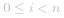
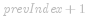

#### 方法一：前缀和 + 哈希表

由于「*0* 和 *1* 的数量相同」等价于「*1* 的数量减去 *0* 的数量等于 *0*」，我们可以将数组中的 *0* 视作 *-1*，则原问题转换成「求最长的连续子数组，其元素和为 *0*」。

设数组   的长度为 *n*，将数组   进行转换得到长度相等的新数组  ：对于  ，当 ![\textit{nums}\[i\]=1 ](./p__textit{nums}_i_=1_.png)  时 ![\textit{newNums}\[i\]=1 ](./p__textit{newNums}_i_=1_.png) ，当 ![\textit{nums}\[i\]=0 ](./p__textit{nums}_i_=0_.png)  时 ![\textit{newNums}\[i\]=-1 ](./p__textit{newNums}_i_=-1_.png) 。

为了快速计算   的子数组的元素和，需要首先计算   的前缀和。用 ![\textit{prefixSums}\[i\] ](./p__textit{prefixSums}_i__.png)  表示   从下标 *0* 到下标 *i* 的前缀和，则   从下标 *j+1* 到下标 *k*（其中 *j<k*）的子数组的元素和为 ![\textit{prefixSums}\[k\]-\textit{prefixSums}\[j\] ](./p__textit{prefixSums}_k_-textit{prefixSums}_j__.png) ，该子数组的长度为 *k-j*。

当 ![\textit{prefixSums}\[k\]-\textit{prefixSums}\[j\]=0 ](./p__textit{prefixSums}_k_-textit{prefixSums}_j_=0_.png)  时，即得到   的一个长度为 *k-j* 的子数组元素和为 *0*，对应   的一个长度为 *k-j* 的子数组中有相同数量的 *0* 和 *1*。

实现方面，不需要创建数组   和  ，只需要维护一个变量   存储   的前缀和即可。具体做法是，遍历数组  ，当遇到元素 *1* 时将   的值加 *1*，当遇到元素 *0* 时将   的值减 *1*，遍历过程中使用哈希表存储每个前缀和第一次出现的下标。

规定空的前缀的结束下标为 *-1*，由于空的前缀的元素和为 *0*，因此在遍历之前，首先在哈希表中存入键值对 *(0,-1)*。遍历过程中，对于每个下标 *i*，进行如下操作：

- 如果   的值在哈希表中已经存在，则取出   在哈希表中对应的下标  ，  从下标   到下标 *i* 的子数组中有相同数量的 *0* 和 *1*，该子数组的长度为  ，使用该子数组的长度更新最长连续子数组的长度；

- 如果   的值在哈希表中不存在，则将当前余数和当前下标 *i* 的键值对存入哈希表中。

由于哈希表存储的是   的每个取值第一次出现的下标，因此当遇到重复的前缀和时，根据当前下标和哈希表中存储的下标计算得到的子数组长度是以当前下标结尾的子数组中满足有相同数量的 *0* 和 *1* 的最长子数组的长度。遍历结束时，即可得到   中的有相同数量的 *0* 和 *1* 的最长子数组的长度。

```Java [sol1-Java]
class Solution {
    public int findMaxLength(int[] nums) {
        int maxLength = 0;
        Map<Integer, Integer> map = new HashMap<Integer, Integer>();
        int counter = 0;
        map.put(counter, -1);
        int n = nums.length;
        for (int i = 0; i < n; i++) {
            int num = nums[i];
            if (num == 1) {
                counter++;
            } else {
                counter--;
            }
            if (map.containsKey(counter)) {
                int prevIndex = map.get(counter);
                maxLength = Math.max(maxLength, i - prevIndex);
            } else {
                map.put(counter, i);
            }
        }
        return maxLength;
    }
}
```

```C# [sol1-C#]
public class Solution {
    public int FindMaxLength(int[] nums) {
        int maxLength = 0;
        Dictionary<int, int> dictionary = new Dictionary<int, int>();
        int counter = 0;
        dictionary.Add(counter, -1);
        int n = nums.Length;
        for (int i = 0; i < n; i++) {
            int num = nums[i];
            if (num == 1) {
                counter++;
            } else {
                counter--;
            }
            if (dictionary.ContainsKey(counter)) {
                int prevIndex = dictionary[counter];
                maxLength = Math.Max(maxLength, i - prevIndex);
            } else {
                dictionary.Add(counter, i);
            }
        }
        return maxLength;
    }
}
```

```JavaScript [sol1-JavaScript]
var findMaxLength = function(nums) {
    let maxLength = 0;
    const map = new Map();
    let counter = 0;
    map.set(counter, -1);
    const n = nums.length;
    for (let i = 0; i < n; i++) {
        const num = nums[i];
        if (num == 1) {
            counter++;
        } else {
            counter--;
        }
        if (map.has(counter)) {
            const prevIndex = map.get(counter);
            maxLength = Math.max(maxLength, i - prevIndex);
        } else {
            map.set(counter, i);
        }
    }
    return maxLength;
};
```

```go [sol1-Golang]
func findMaxLength(nums []int) (maxLength int) {
    mp := map[int]int{0: -1}
    counter := 0
    for i, num := range nums {
        if num == 1 {
            counter++
        } else {
            counter--
        }
        if prevIndex, has := mp[counter]; has {
            maxLength = max(maxLength, i-prevIndex)
        } else {
            mp[counter] = i
        }
    }
    return
}

func max(a, b int) int {
    if a > b {
        return a
    }
    return b
}
```

```C++ [sol1-C++]
class Solution {
public:
    int findMaxLength(vector<int>& nums) {
        int maxLength = 0;
        unordered_map<int, int> mp;
        int counter = 0;
        mp[counter] = -1;
        int n = nums.size();
        for (int i = 0; i < n; i++) {
            int num = nums[i];
            if (num == 1) {
                counter++;
            } else {
                counter--;
            }
            if (mp.count(counter)) {
                int prevIndex = mp[counter];
                maxLength = max(maxLength, i - prevIndex);
            } else {
                mp[counter] = i;
            }
        }
        return maxLength;
    }
};
```

```C [sol1-C]
struct HashTable {
    int key, val;
    UT_hash_handle hh;
};

int findMaxLength(int* nums, int numsSize) {
    int maxLength = 0;
    struct HashTable* hashTable = NULL;
    struct HashTable* tmp = malloc(sizeof(struct HashTable));
    tmp->key = 0, tmp->val = -1;
    HASH_ADD_INT(hashTable, key, tmp);
    int counter = 0;
    int n = numsSize;
    for (int i = 0; i < n; i++) {
        int num = nums[i];
        if (num == 1) {
            counter++;
        } else {
            counter--;
        }
        HASH_FIND_INT(hashTable, &counter, tmp);
        if (tmp != NULL) {
            int prevIndex = tmp->val;
            maxLength = fmax(maxLength, i - prevIndex);
        } else {
            tmp = malloc(sizeof(struct HashTable));
            tmp->key = counter, tmp->val = i;
            HASH_ADD_INT(hashTable, key, tmp);
        }
    }
    return maxLength;
}
```

**复杂度分析**

- 时间复杂度：*O(n)*，其中 *n* 是数组   的长度。需要遍历数组一次。

- 空间复杂度：*O(n)*，其中 *n* 是数组   的长度。空间复杂度主要取决于哈希表，哈希表中存储的不同的   的值不超过 *n* 个。