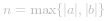
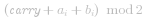
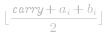
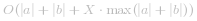
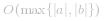

#### 题目分析

考虑一个最朴素的方法：先将 *a* 和 *b* 转化成十进制数，求和后再转化为二进制数。利用 Python 和 Java 自带的高精度运算，我们可以很简单地写出这个程序：

```python [pre-Python3]
class Solution:
    def addBinary(self, a, b) -> str:
        return '{0:b}'.format(int(a, 2) + int(b, 2))
```

```Java [pre-Java]
class Solution {
    public String addBinary(String a, String b) {
        return Integer.toBinaryString(
            Integer.parseInt(a, 2) + Integer.parseInt(b, 2)
        );
    }
}
```

如果 *a* 的位数是 *n*，*b* 的位数为 *m*，这个算法的渐进时间复杂度为 *O(n + m)*。但是这里非常简单的实现基于 Python 和 Java 本身的高精度功能，在其他的语言中可能并不适用，并且在 Java 中：

+ 如果字符串超过 *33* 位，不能转化为 `Integer`
+ 如果字符串超过 *65* 位，不能转化为 `Long`
+ 如果字符串超过 *500000001* 位，不能转化为 `BigInteger`

因此，为了适用于长度较大的字符串计算，我们应该使用更加健壮的算法。


#### 方法一：模拟

**思路和算法**

我们可以借鉴「列竖式」的方法，末尾对齐，逐位相加。在十进制的计算中「逢十进一」，二进制中我们需要「逢二进一」。

具体的，我们可以取  ，循环 *n* 次，从最低位开始遍历。我们使用一个变量   表示上一个位置的进位，初始值为 *0*。记当前位置对其的两个位为 *a_i* 和 *b_i*，则每一位的答案为  ，下一位的进位为  。重复上述步骤，直到数字 *a* 和 *b* 的每一位计算完毕。最后如果   的最高位不为 *0*，则将最高位添加到计算结果的末尾。

注意，为了让各个位置对齐，你可以先反转这个代表二进制数字的字符串，然后低下标对应低位，高下标对应高位。当然你也可以直接把 *a* 和 *b* 中短的那一个补 *0* 直到和长的那个一样长，然后从高位向低位遍历，对应位置的答案按照顺序存入答案字符串内，最终将答案串反转。这里的代码给出第一种的实现。

**代码**

```Java [sol1-Java]
class Solution {
    public String addBinary(String a, String b) {
        StringBuffer ans = new StringBuffer();

        int n = Math.max(a.length(), b.length()), carry = 0;
        for (int i = 0; i < n; ++i) {
            carry += i < a.length() ? (a.charAt(a.length() - 1 - i) - '0') : 0;
            carry += i < b.length() ? (b.charAt(b.length() - 1 - i) - '0') : 0;
            ans.append((char) (carry % 2 + '0'));
            carry /= 2;
        }

        if (carry > 0) {
            ans.append('1');
        }
        ans.reverse();

        return ans.toString();
    }
}
```

```cpp [sol1-C++]
class Solution {
public:
    string addBinary(string a, string b) {
        string ans;
        reverse(a.begin(), a.end());
        reverse(b.begin(), b.end());

        int n = max(a.size(), b.size()), carry = 0;
        for (size_t i = 0; i < n; ++i) {
            carry += i < a.size() ? (a.at(i) == '1') : 0;
            carry += i < b.size() ? (b.at(i) == '1') : 0;
            ans.push_back((carry % 2) ? '1' : '0');
            carry /= 2;
        }

        if (carry) {
            ans.push_back('1');
        }
        reverse(ans.begin(), ans.end());

        return ans;
    }
};
```

```golang [sol1-Golang]
func addBinary(a string, b string) string {
    ans := ""
    carry := 0
    lenA, lenB := len(a), len(b)
    n := max(lenA, lenB)

    for i := 0; i < n; i++ {
        if i < lenA {
            carry += int(a[lenA-i-1] - '0')
        }
        if i < lenB {
            carry += int(b[lenB-i-1] - '0')
        }
        ans = strconv.Itoa(carry%2) + ans
        carry /= 2
    }
    if carry > 0 {
        ans = "1" + ans
    }
    return ans
}

func max(x, y int) int {
    if x > y {
        return x
    }
    return y
}
```

```C [sol1-C]
void reserve(char* s) {
    int len = strlen(s);
    for (int i = 0; i < len / 2; i++) {
        char t = s[i];
        s[i] = s[len - i - 1], s[len - i - 1] = t;
    }
}

char* addBinary(char* a, char* b) {
    reserve(a);
    reserve(b);

    int len_a = strlen(a), len_b = strlen(b);
    int n = fmax(len_a, len_b), carry = 0, len = 0;
    char* ans = (char*)malloc(sizeof(char) * (n + 2));
    for (int i = 0; i < n; ++i) {
        carry += i < len_a ? (a[i] == '1') : 0;
        carry += i < len_b ? (b[i] == '1') : 0;
        ans[len++] = carry % 2 + '0';
        carry /= 2;
    }

    if (carry) {
        ans[len++] = '1';
    }
    ans[len] = '\0';
    reserve(ans);

    return ans;
}
```

**复杂度分析**

假设  。

- 时间复杂度：*O(n)*，这里的时间复杂度来源于顺序遍历 *a* 和 *b*。
- 空间复杂度：*O(1)*，除去答案所占用的空间，这里使用了常数个临时变量。

#### 方法二：位运算

**思路和算法**

如果不允许使用加减乘除，则可以使用位运算替代上述运算中的一些加减乘除的操作。

如果不了解位运算，可以先了解位运算并尝试练习以下题目：

+ [只出现一次的数字 II](https://leetcode-cn.com/problems/single-number-ii/)
+ [只出现一次的数字 III](https://leetcode-cn.com/problems/single-number-iii/)
+ [数组中两个数的最大异或值](https://leetcode-cn.com/problems/maximum-xor-of-two-numbers-in-an-array/)
+ [重复的DNA序列](https://leetcode-cn.com/problems/repeated-dna-sequences/)
+ [最大单词长度乘积](https://leetcode-cn.com/problems/maximum-product-of-word-lengths/)

我们可以设计这样的算法来计算：

+ 把 *a* 和 *b* 转换成整型数字 *x* 和 *y*，在接下来的过程中，*x* 保存结果，*y* 保存进位。
+ 当进位不为 *0* 时
  + 计算当前 *x* 和 *y* 的无进位相加结果：`answer = x ^ y`
  + 计算当前 *x* 和 *y* 的进位：`carry = (x & y) << 1`
  + 完成本次循环，更新 `x = answer`，`y = carry`
+ 返回 *x* 的二进制形式

为什么这个方法是可行的呢？在第一轮计算中，`answer` 的最后一位是 *x* 和 *y* 相加之后的结果，`carry` 的倒数第二位是 *x* 和 *y* 最后一位相加的进位。接着每一轮中，由于 `carry` 是由 *x* 和 *y* 按位与并且左移得到的，那么最后会补零，所以在下面计算的过程中后面的数位不受影响，而每一轮都可以得到一个低 *i* 位的答案和它向低 *i + 1* 位的进位，也就模拟了加法的过程。

**代码**

```python [sol2-Python3]
class Solution:
    def addBinary(self, a, b) -> str:
        x, y = int(a, 2), int(b, 2)
        while y:
            answer = x ^ y
            carry = (x & y) << 1
            x, y = answer, carry
        return bin(x)[2:]
```

**复杂度分析**

- 时间复杂度： ，字符串转化成数字需要的时间代价为 *O(|a| + |b|)*，计算的时间代价为  ，*X* 为位运算所需的时间，因为这里用到了高精度计算，所以位运算的时间不一定为 *O(1)*。
- 空间复杂度：这里使用了 *x* 和 *y* 来保存 *a* 和 *b* 的整数形式，如果用 Python 实现，这里用到了 Python 的高精度功能，实际的空间代价是 *O(|a| + |b|)*。