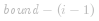
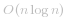
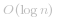
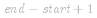
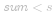

#### 方法一：前缀和 + 二分查找

为了使用二分查找，需要额外创建一个数组   用于存储数组   的前缀和，其中 ![\text{sums}\[i\] ](./p__text{sums}_i__.png)  表示从 ![\text{nums}\[0\] ](./p__text{nums}_0__.png)  到 ![\text{nums}\[i-1\] ](./p__text{nums}_i-1__.png)  的元素和。得到前缀和之后，对于每个开始下标 *i*，可通过二分查找得到大于或等于 *i* 的最小下标  ，使得 ![\text{sums}\[\textit{bound}\]-\text{sums}\[i-1\]\ges ](./p__text{sums}_textit{bound}_-text{sums}_i-1__ge_s_.png) ，并更新子数组的最小长度（此时子数组的长度是  ）。

**因为这道题保证了数组中每个元素都为正，所以前缀和一定是递增的，这一点保证了二分的正确性。如果题目没有说明数组中每个元素都为正，这里就不能使用二分来查找这个位置了。**

在很多语言中，都有现成的库和函数来为我们实现这里二分查找大于等于某个数的第一个位置的功能，比如 `C++` 的 `lower_bound`，`Java` 中的 `Arrays.binarySearch`，`C#` 中的 `Array.BinarySearch`，Python 中的 `bisect.bisect_left`。但是有时面试官可能会让我们自己实现一个这样的二分查找函数，这里给出一个 `C#` 的版本，供读者参考：

```csharp [lowerbound-C#]
private int LowerBound(int[] a, int l, int r, int target) 
{
    int mid = -1, originL = l, originR = r;
    while (l < r) 
    {
        mid = (l + r) >> 1;
        if (a[mid] < target) l = mid + 1;
        else r = mid;
    } 

    return (a[l] >= target) ? l : -1;
}
```

下面是这道题的代码。

```Java [sol1-Java]
class Solution {
    public int minSubArrayLen(int s, int[] nums) {
        int n = nums.length;
        if (n == 0) {
            return 0;
        }
        int ans = Integer.MAX_VALUE;
        int[] sums = new int[n + 1]; 
        // 为了方便计算，令 size = n + 1 
        // sums[0] = 0 意味着前 0 个元素的前缀和为 0
        // sums[1] = A[0] 前 1 个元素的前缀和为 A[0]
        // 以此类推
        for (int i = 1; i <= n; i++) {
            sums[i] = sums[i - 1] + nums[i - 1];
        }
        for (int i = 1; i <= n; i++) {
            int target = s + sums[i - 1];
            int bound = Arrays.binarySearch(sums, target);
            if (bound < 0) {
                bound = -bound - 1;
            }
            if (bound <= n) {
                ans = Math.min(ans, bound - (i - 1));
            }
        }
        return ans == Integer.MAX_VALUE ? 0 : ans;
    }
}
```

```C++ [sol1-C++]
class Solution {
public:
    int minSubArrayLen(int s, vector<int>& nums) {
        int n = nums.size();
        if (n == 0) {
            return 0;
        }
        int ans = INT_MAX;
        vector<int> sums(n + 1, 0); 
        // 为了方便计算，令 size = n + 1 
        // sums[0] = 0 意味着前 0 个元素的前缀和为 0
        // sums[1] = A[0] 前 1 个元素的前缀和为 A[0]
        // 以此类推
        for (int i = 1; i <= n; i++) {
            sums[i] = sums[i - 1] + nums[i - 1];
        }
        for (int i = 1; i <= n; i++) {
            int target = s + sums[i - 1];
            auto bound = lower_bound(sums.begin(), sums.end(), target);
            if (bound != sums.end()) {
                ans = min(ans, static_cast<int>((bound - sums.begin()) - (i - 1)));
            }
        }
        return ans == INT_MAX ? 0 : ans;
    }
};
```

```csharp [sol1-C#]
public class Solution {
    private int LowerBound(int[] a, int l, int r, int target) 
    {
        int mid = -1, originL = l, originR = r;
        while (l < r) 
        {
            mid = (l + r) >> 1;
            if (a[mid] < target) l = mid + 1;
            else r = mid;
        } 

        return (a[l] >= target) ? l : -1;
    }

    public int MinSubArrayLen(int s, int[] nums) 
    {
        int n = nums.Length;
        if (n == 0) 
        {
            return 0;
        }

        int ans = int.MaxValue;
        int[] sums = new int[n + 1]; 
        // 为了方便计算，令 size = n + 1 
        // sums[0] = 0 意味着前 0 个元素的前缀和为 0
        // sums[1] = A[0] 前 1 个元素的前缀和为 A[0]
        // 以此类推
        for (int i = 1; i <= n; ++i) 
        {
            sums[i] = sums[i - 1] + nums[i - 1];
        }

        for (int i = 1; i <= n; ++i) 
        {
            int target = s + sums[i - 1];
            int bound = LowerBound(sums, i, n, target);
            if (bound != -1)
            {
                ans = Math.Min(ans, bound - i + 1);
            }
        }

        return ans == int.MaxValue ? 0 : ans;
    }
}
```

```golang [sol1-Golang]
func minSubArrayLen(s int, nums []int) int {
    n := len(nums)
    if n == 0 {
        return 0
    }
    ans := math.MaxInt32
    sums := make([]int, n + 1)
    // 为了方便计算，令 size = n + 1 
    // sums[0] = 0 意味着前 0 个元素的前缀和为 0
    // sums[1] = A[0] 前 1 个元素的前缀和为 A[0]
    // 以此类推
    for i := 1; i <= n; i++ {
        sums[i] = sums[i - 1] + nums[i - 1]
    }
    for i := 1; i <= n; i++ {
        target := s + sums[i-1]
        bound := sort.SearchInts(sums, target)
        if bound < 0 {
            bound = -bound - 1
        }
        if bound <= n {
            ans = min(ans, bound - (i - 1))
        }
    }
    if ans == math.MaxInt32 {
        return 0
    }
    return ans
}

func min(x, y int) int {
    if x < y {
        return x
    }
    return y
}
```

```Python [sol1-Python3]
class Solution:
    def minSubArrayLen(self, s: int, nums: List[int]) -> int:
        if not nums:
            return 0
        
        n = len(nums)
        ans = n + 1
        sums = [0]
        for i in range(n):
            sums.append(sums[-1] + nums[i])
        
        for i in range(1, n + 1):
            target = s + sums[i - 1]
            bound = bisect.bisect_left(sums, target)
            if bound != len(sums):
                ans = min(ans, bound - (i - 1))
        
        return 0 if ans == n + 1 else ans
```

```C [sol1-C]
int lower_bound(int *a, int l, int r, int q) {
    if (a[r] < q) return -1;
    while (l < r) {
        int mid = (l + r) >> 1;
        if (a[mid] >= q) {
            r = mid;
        } else {
            l = mid + 1;
        }
    }
    return l;
}
int minSubArrayLen(int s, int *nums, int numsSize) {
    if (numsSize == 0) {
        return 0;
    }
    int ans = INT_MAX;
    int *sums = (int *)malloc(sizeof(int) * (numsSize + 1));
    // 为了方便计算，令 size = n + 1
    // sums[0] = 0 意味着前 0 个元素的前缀和为 0
    // sums[1] = A[0] 前 1 个元素的前缀和为 A[0]
    // 以此类推
    for (int i = 1; i <= numsSize; i++) {
        sums[i] = sums[i - 1] + nums[i - 1];
    }
    for (int i = 1; i <= numsSize; i++) {
        int target = s + sums[i - 1];
        int bound = lower_bound(sums, 1, numsSize, target);
        if (bound != -1) {
            ans = fmin(ans, bound - (i - 1));
        }
    }
    return ans == INT_MAX ? 0 : ans;
}
```

**复杂度分析**

- 时间复杂度： ，其中 *n* 是数组的长度。需要遍历每个下标作为子数组的开始下标，遍历的时间复杂度是 *O(n)*，对于每个开始下标，需要通过二分查找得到长度最小的子数组，二分查找得时间复杂度是  ，因此总时间复杂度是  。

- 空间复杂度：*O(n)*，其中 *n* 是数组的长度。额外创建数组   存储前缀和。

#### 方法二：滑动窗口

在方法一中，每次确定子数组的开始下标，然后得到长度最小的子数组，因此时间复杂度较高。为了降低时间复杂度，可以使用滑动窗口的方法。

定义两个指针   和   分别表示子数组（滑动窗口窗口）的开始位置和结束位置，维护变量   存储子数组中的元素和（即从 ![\text{nums}\[\textit{start}\] ](./p__text{nums}_textit{start}__.png)  到 ![\text{nums}\[\textit{end}\] ](./p__text{nums}_textit{end}__.png)  的元素和）。

初始状态下，  和   都指向下标 *0*，  的值为 *0*。

每一轮迭代，将 ![\text{nums}\[end\] ](./p__text{nums}_end__.png)  加到  ，如果  ，则更新子数组的最小长度（此时子数组的长度是  ），然后将 ![\text{nums}\[start\] ](./p__text{nums}_start__.png)  从   中减去并将   右移，直到  ，在此过程中同样更新子数组的最小长度。在每一轮迭代的最后，将   右移。

             

```Java [sol2-Java]
class Solution {
    public int minSubArrayLen(int s, int[] nums) {
        int n = nums.length;
        if (n == 0) {
            return 0;
        }
        int ans = Integer.MAX_VALUE;
        int start = 0, end = 0;
        int sum = 0;
        while (end < n) {
            sum += nums[end];
            while (sum >= s) {
                ans = Math.min(ans, end - start + 1);
                sum -= nums[start];
                start++;
            }
            end++;
        }
        return ans == Integer.MAX_VALUE ? 0 : ans;
    }
}
```

```C++ [sol2-C++]
class Solution {
public:
    int minSubArrayLen(int s, vector<int>& nums) {
        int n = nums.size();
        if (n == 0) {
            return 0;
        }
        int ans = INT_MAX;
        int start = 0, end = 0;
        int sum = 0;
        while (end < n) {
            sum += nums[end];
            while (sum >= s) {
                ans = min(ans, end - start + 1);
                sum -= nums[start];
                start++;
            }
            end++;
        }
        return ans == INT_MAX ? 0 : ans;
    }
};
```

```csharp [sol2-C#]
public class Solution {
    public int MinSubArrayLen(int s, int[] nums) 
    {
        int n = nums.Length;
        if (n == 0) 
        {
            return 0;
        }

        int ans = int.MaxValue;
        int start = 0, end = 0;
        int sum = 0;
        while (end < n) 
        {
            sum += nums[end];
            while (sum >= s) 
            {
                ans = Math.Min(ans, end - start + 1);
                sum -= nums[start];
                ++start;
            }
            
            ++end;
        }

        return ans == int.MaxValue ? 0 : ans;
    }
}
```

```golang [sol2-Golang]
func minSubArrayLen(s int, nums []int) int {
    n := len(nums)
    if n == 0 {
        return 0
    }
    ans := math.MaxInt32
    start, end := 0, 0
    sum := 0
    for end < n {
        sum += nums[end]
        for sum >= s {
            ans = min(ans, end - start + 1)
            sum -= nums[start]
            start++
        }
        end++
    }
    if ans == math.MaxInt32 {
        return 0
    }
    return ans
}

func min(x, y int) int {
    if x < y {
        return x
    }
    return y
}
```

```Python [sol2-Python3]
class Solution:
    def minSubArrayLen(self, s: int, nums: List[int]) -> int:
        if not nums:
            return 0
        
        n = len(nums)
        ans = n + 1
        start, end = 0, 0
        total = 0
        while end < n:
            total += nums[end]
            while total >= s:
                ans = min(ans, end - start + 1)
                total -= nums[start]
                start += 1
            end += 1
        
        return 0 if ans == n + 1 else ans
```

```C [sol2-C]
int minSubArrayLen(int s, int *nums, int numsSize) {
    if (numsSize == 0) {
        return 0;
    }
    int ans = INT_MAX;
    int start = 0, end = 0;
    int sum = 0;
    while (end < numsSize) {
        sum += nums[end];
        while (sum >= s) {
            ans = fmin(ans, end - start + 1);
            sum -= nums[start];
            start++;
        }
        end++;
    }
    return ans == INT_MAX ? 0 : ans;
}
```

**复杂度分析**

- 时间复杂度：*O(n)*，其中 *n* 是数组的长度。指针   和   最多各移动 *n* 次。

- 空间复杂度：*O(1)*。