#### 方法一：哈希表

**思路与算法**

我们可以使用哈希映射统计数组中每个元素的出现次数。对于哈希映射中的每个键值对，键表示一个元素，值表示其出现的次数。

在统计完成后，我们遍历哈希映射即可找出只出现一次的元素。

**代码**

```C++ [sol1-C++]
class Solution {
public:
    int singleNumber(vector<int>& nums) {
        unordered_map<int, int> freq;
        for (int num: nums) {
            ++freq[num];
        }
        int ans = 0;
        for (auto [num, occ]: freq) {
            if (occ == 1) {
                ans = num;
                break;
            }
        }
        return ans;
    }
};
```

```Java [sol1-Java]
class Solution {
    public int singleNumber(int[] nums) {
        Map<Integer, Integer> freq = new HashMap<Integer, Integer>();
        for (int num : nums) {
            freq.put(num, freq.getOrDefault(num, 0) + 1);
        }
        int ans = 0;
        for (Map.Entry<Integer, Integer> entry : freq.entrySet()) {
            int num = entry.getKey(), occ = entry.getValue();
            if (occ == 1) {
                ans = num;
                break;
            }
        }
        return ans;
    }
}
```

```Python [sol1-Python3]
class Solution:
    def singleNumber(self, nums: List[int]) -> int:
        freq = collections.Counter(nums)
        ans = [num for num, occ in freq.items() if occ == 1][0]
        return ans
```

```JavaScript [sol1-JavaScript]
var singleNumber = function(nums) {
    const freq = new Map();
    for (const num of nums) {
        freq.set(num, (freq.get(num) || 0) + 1);
    }
    let ans = 0;
    for (const [num, occ] of freq.entries()) {
        if (occ === 1) {
            ans = num;
            break;
        }
    }
    return ans;
};
```

```go [sol1-Golang]
func singleNumber(nums []int) int {
    freq := map[int]int{}
    for _, v := range nums {
        freq[v]++
    }
    for num, occ := range freq {
        if occ == 1 {
            return num
        }
    }
    return 0 // 不会发生，数据保证有一个元素仅出现一次
}
```

```C [sol1-C]
struct HashTable {
    int key, val;
    UT_hash_handle hh;
};

int singleNumber(int *nums, int numsSize) {
    struct HashTable *hashTable = NULL;
    for (int i = 0; i < numsSize; i++) {
        struct HashTable *tmp;
        HASH_FIND_INT(hashTable, &nums[i], tmp);
        if (tmp == NULL) {
            tmp = malloc(sizeof(struct HashTable));
            tmp->key = nums[i];
            tmp->val = 1;
            HASH_ADD_INT(hashTable, key, tmp);
        } else {
            tmp->val++;
        }
    }
    int ans = 0;
    struct HashTable *iter, *tmp;
    HASH_ITER(hh, hashTable, iter, tmp) {
        if (iter->val == 1) {
            ans = iter->key;
            break;
        }
    }
    return ans;
}
```

**复杂度分析**

- 时间复杂度：*O(n)*，其中 *n* 是数组的长度。

- 空间复杂度：*O(n)*。哈希映射中包含最多 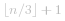  个元素，即需要的空间为 *O(n)*。

#### 方法二：依次确定每一个二进制位

**思路与算法**

为了方便叙述，我们称「只出现了一次的元素」为「答案」。

由于数组中的元素都在 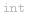 （即 *32* 位整数）范围内，因此我们可以依次计算答案的每一个二进制位是 *0* 还是 *1*。

具体地，考虑答案的第 *i* 个二进制位（*i* 从 *0* 开始编号），它可能为 *0* 或 *1*。对于数组中非答案的元素，每一个元素都出现了 *3* 次，对应着第 *i* 个二进制位的 *3* 个 *0* 或 *3* 个 *1*，无论是哪一种情况，它们的和都是 *3* 的倍数（即和为 *0* 或 *3*）。因此：

> 答案的第 *i* 个二进制位就是数组中所有元素的第 *i* 个二进制位之和除以 *3* 的余数。

这样一来，对于数组中的每一个元素 *x*，我们使用位运算 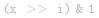  得到 *x* 的第 *i* 个二进制位，并将它们相加再对 *3* 取余，得到的结果一定为 *0* 或 *1*，即为答案的第 *i* 个二进制位。

**细节**

需要注意的是，如果使用的语言对「有符号整数类型」和「无符号整数类型」没有区分，那么可能会得到错误的答案。这是因为「有符号整数类型」（即   类型）的第 *31* 个二进制位（即最高位）是补码意义下的符号位，对应着 *-2^{31}*，而「无符号整数类型」由于没有符号，第 *31* 个二进制位对应着 *2^{31}*。因此在某些语言（例如 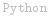 ）中需要对最高位进行特殊判断。

**代码**

```C++ [sol2-C++]
class Solution {
public:
    int singleNumber(vector<int>& nums) {
        int ans = 0;
        for (int i = 0; i < 32; ++i) {
            int total = 0;
            for (int num: nums) {
                total += ((num >> i) & 1);
            }
            if (total % 3) {
                ans |= (1 << i);
            }
        }
        return ans;
    }
};
```

```Java [sol2-Java]
class Solution {
    public int singleNumber(int[] nums) {
        int ans = 0;
        for (int i = 0; i < 32; ++i) {
            int total = 0;
            for (int num: nums) {
                total += ((num >> i) & 1);
            }
            if (total % 3 != 0) {
                ans |= (1 << i);
            }
        }
        return ans;
    }
}
```

```Python [sol2-Python3]
class Solution:
    def singleNumber(self, nums: List[int]) -> int:
        ans = 0
        for i in range(32):
            total = sum((num >> i) & 1 for num in nums)
            if total % 3:
                # Python 这里对于最高位需要特殊判断
                if i == 31:
                    ans -= (1 << i)
                else:
                    ans |= (1 << i)
        return ans
```

```JavaScript [sol2-JavaScript]
var singleNumber = function(nums) {
    let ans = 0;
    for (let i = 0; i < 32; ++i) {
        let total = 0;
        for (const num of nums) {
            total += ((num >> i) & 1);
        }
        if (total % 3 != 0) {
            ans |= (1 << i);
        }
    }
    return ans;
};
```

```go [sol2-Golang]
func singleNumber(nums []int) int {
    ans := int32(0)
    for i := 0; i < 32; i++ {
        total := int32(0)
        for _, num := range nums {
            total += int32(num) >> i & 1
        }
        if total%3 > 0 {
            ans |= 1 << i
        }
    }
    return int(ans)
}
```

```C [sol2-C]
int singleNumber(int *nums, int numsSize) {
    int ans = 0;
    for (int i = 0; i < 32; ++i) {
        int total = 0;
        for (int j = 0; j < numsSize; ++j) {
            total += ((nums[j] >> i) & 1);
        }
        if (total % 3) {
            ans |= (1u << i);
        }
    }
    return ans;
}
```

**复杂度分析**

- 时间复杂度：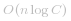 ，其中 *n* 是数组的长度，*C* 是元素的数据范围，在本题中 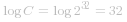 ，也就是我们需要遍历第 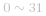  个二进制位。

- 空间复杂度：*O(1)*。

#### 方法三：数字电路设计

**说明**

方法三以及后续进行优化的方法四需要读者有一定的数字电路设计的基础。读者需要对以下知识：

- 简单的门电路（例如与门、异或门等）

- 给定数字电路输入和输出（真值表），使用门电路设计出一种满足要求的数字电路结构

有一定的了解。

**门电路表示**

我们将会用到四种门电路，使用的符号如下：

- 非门：我们用 *A'* 表示输入为 *A* 的非门的输出；

- 与门：我们用 *AB* 表示输入为 *A* 和 *B* 的与门的输出。由于「与运算」具有结合律，因此如果同时用了多个与门（例如将 *A* 和 *B* 进行与运算后，再和 *C* 进行与运算），我们可以将多个输入写在一起（例如 *ABC*）；

- 或门：我们用 *A+B* 表示输入为 *A* 和 *B* 的或门的输出。同样地，多个或门可以写在一起（例如 *A+B+C*）；

- 异或门：我们用 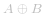  表示输入为 *A* 和 *B* 的异或门的输出。同样的，多个异或门可以写在一起（例如 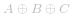 ）。

**思路与算法**

在方法二中，我们是依次处理每一个二进制位的，那么时间复杂度中就引入了 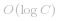  这一项。既然我们在对两个整数进行普通的二元运算时，都是将它们看成整体进行处理的，那么我们是否能以普通的二元运算为基础，同时处理所有的二进制位？

答案是可以的。我们可以使用一个「黑盒」存储当前遍历过的所有整数。「黑盒」的第 *i* 位为 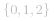  三者之一，表示当前遍历过的所有整数的第 *i* 位之和除以 *3* 的余数。但由于二进制表示中只有 *0* 和 *1* 而没有 *2*，因此我们可以考虑在「黑盒」中使用两个整数来进行存储，即：

> 黑盒中存储了两个整数 *a* 和 *b*，且会有三种情况：
> - *a* 的第 *i* 位为 *0* 且 *b* 的第 *i* 位为 *0*，表示 *0*；
> - *a* 的第 *i* 位为 *0* 且 *b* 的第 *i* 位为 *1*，表示 *1*；
> - *a* 的第 *i* 位为 *1* 且 *b* 的第 *i* 位为 *0*，表示 *2*。
>
> 为了方便叙述，我们用 *(00)* 表示 *a* 的第 *i* 位为 *0* 且 *b* 的第 *i* 位为 *0*，其余的情况类似。

当我们遍历到一个新的整数 *x* 时，对于 *x* 的第 *i* 位 *x_i*，如果 *x_i=0*，那么 *a* 和 *b* 的第 *i* 位不变；如果 *x_i=1*，那么 *a* 和 *b* 的第 *i* 位按照 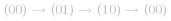  这一循环进行变化。因此我们可以得出下面的真值表：

| *(a_i ~ b_i)* | *x_i* | 新的 *(a_i ~ b_i)* |
| :-: | :-: | :-: |
| *00* | *0* | *00* |
| *00* | *1* | *01* |
| *01* | *0* | *01* |
| *01* | *1* | *10* |
| *10* | *0* | *10* |
| *10* | *1* | *00* |

当我们考虑输出为 *a_i* 时：

| *(a_i ~ b_i)* | *x_i* | 新的 *a_i* |
| :-: | :-: | :-: |
| *00* | *0* | *0* |
| *00* | *1* | *0* |
| *01* | *0* | *0* |
| *01* | *1* | *1* |
| *10* | *0* | *1* |
| *10* | *1* | *0* |

根据真值表可以设计出电路：

*
a_i = a_i'b_ix_i + a_ib_i'x_i'
*

当我们考虑输出为 *b_i* 时：

| *(a_i ~ b_i)* | *x_i* | 新的 *b_i* |
| :-: | :-: | :-: |
| *00* | *0* | *0* |
| *00* | *1* | *1* |
| *01* | *0* | *1* |
| *01* | *1* | *0* |
| *10* | *0* | *0* |
| *10* | *1* | *0* |

根据真值表可以设计出电路：

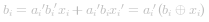 

将上面的电路逻辑运算转换为等价的整数位运算，最终的转换规则即为：

 

其中   分别表示按位非、与、或、异或运算。

当我们遍历完数组中的所有元素后，*(a_i b_i)* 要么是 *(00)*，表示答案的第 *i* 位是 *0*；要么是 *(01)*，表示答案的第 *i* 位是 *1*。因此我们只需要返回 *b* 作为答案即可。

**细节**

由于电路中的 *a_i* 和 *b_i* 是「同时」得出结果的，因此我们在计算 *a* 和 *b* 时，需要使用临时变量暂存它们之前的值，再使用转换规则进行计算。

**代码**

```C++ [sol3-C++]
class Solution {
public:
    int singleNumber(vector<int>& nums) {
        int a = 0, b = 0;
        for (int num: nums) {
            tie(a, b) = pair{(~a & b & num) | (a & ~b & ~num), ~a & (b ^ num)};
        }
        return b;
    }
};
```

```Java [sol3-Java]
class Solution {
    public int singleNumber(int[] nums) {
        int a = 0, b = 0;
        for (int num : nums) {
            int aNext = (~a & b & num) | (a & ~b & ~num), bNext = ~a & (b ^ num);
            a = aNext;
            b = bNext;
        }
        return b;
    }
}
```

```Python [sol3-Python3]
class Solution:
    def singleNumber(self, nums: List[int]) -> int:
        a = b = 0
        for num in nums:
            a, b = (~a & b & num) | (a & ~b & ~num), ~a & (b ^ num)
        return b
```

```JavaScript [sol3-JavaScript]
var singleNumber = function(nums) {
    let a = 0, b = 0;
    for (const num of nums) {
        const aNext = (~a & b & num) | (a & ~b & ~num), bNext = ~a & (b ^ num);
        a = aNext;
        b = bNext;
    }
    return b;
};
```

```go [sol3-Golang]
func singleNumber(nums []int) int {
    a, b := 0, 0
    for _, num := range nums {
        a, b = b&^a&num|a&^b&^num, (b^num)&^a
    }
    return b
}
```

```C [sol3-C]
int singleNumber(int *nums, int numsSize) {
    int a = 0, b = 0;
    for (int i = 0; i < numsSize; i++) {
        int tmp_a = (~a & b & nums[i]) | (a & ~b & ~nums[i]);
        int tmp_b = ~a & (b ^ nums[i]);
        a = tmp_a;
        b = tmp_b;
    }
    return b;
}
```

**复杂度分析**

- 时间复杂度：*O(n)*，其中 *n* 是数组的长度。

- 空间复杂度：*O(1)*。

#### 方法四：数字电路设计优化

**思路与算法**

我们发现方法三中计算 *b* 的规则较为简单，而 *a* 的规则较为麻烦，因此可以将「同时计算」改为「分别计算」，即先计算出 *b*，再拿新的 *b* 值计算 *a*。

对于原始的真值表：

| *(a_i ~ b_i)* | *x_i* | 新的 *(a_i ~ b_i)* |
| :-: | :-: | :-: |
| *00* | *0* | *00* |
| *00* | *1* | *01* |
| *01* | *0* | *01* |
| *01* | *1* | *10* |
| *10* | *0* | *10* |
| *10* | *1* | *00* |

我们将第一列的 *b_i* 替换新的 *b_i* 即可得到：

| *(a_i,* 新的 *b_i)* | *x_i* | 新的 *a_i* |
| :-: | :-: | :-: |
| *00* | *0* | *0* |
| *01* | *1* | *0* |
| *01* | *0* | *0* |
| *00* | *1* | *1* |
| *10* | *0* | *1* |
| *10* | *1* | *0* |

根据真值表可以设计出电路：

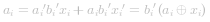 

这样就与 *b_i* 的电路逻辑非常类似了。最终的转换规则即为：

 

需要注意先计算 *b*，再计算 *a*。

**代码**

```C++ [sol4-C++]
class Solution {
public:
    int singleNumber(vector<int>& nums) {
        int a = 0, b = 0;
        for (int num: nums) {
            b = ~a & (b ^ num);
            a = ~b & (a ^ num);
        }
        return b;
    }
};
```

```Java [sol4-Java]
class Solution {
    public int singleNumber(int[] nums) {
        int a = 0, b = 0;
        for (int num : nums) {
            b = ~a & (b ^ num);
            a = ~b & (a ^ num);
        }
        return b;
    }
}
```

```Python [sol4-Python3]
class Solution:
    def singleNumber(self, nums: List[int]) -> int:
        a = b = 0
        for num in nums:
            b = ~a & (b ^ num)
            a = ~b & (a ^ num)
        return b
```

```JavaScript [sol4-JavaScript]
var singleNumber = function(nums) {
    let a = 0, b = 0;
    for (const num of nums) {
        b = ~a & (b ^ num);
        a = ~b & (a ^ num);
    }
    return b;
};
```

```go [sol4-Golang]
func singleNumber(nums []int) int {
    a, b := 0, 0
    for _, num := range nums {
        b = (b ^ num) &^ a
        a = (a ^ num) &^ b
    }
    return b
}
```

```C [sol4-C]
int singleNumber(int *nums, int numsSize) {
    int a = 0, b = 0;
    for (int i = 0; i < numsSize; i++) {
        b = ~a & (b ^ nums[i]);
        a = ~b & (a ^ nums[i]);
    }
    return b;
}
```

**复杂度分析**

- 时间复杂度：*O(n)*，其中 *n* 是数组的长度。

- 空间复杂度：*O(1)*。